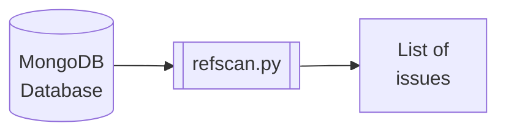

# refscan

`refscan` is a command-line tool people can use to scan a static (not changing) MongoDB database for referential
integrity issues.

## Development status

`refscan` is in early development and its author does not recommend anyone use it for anything.
