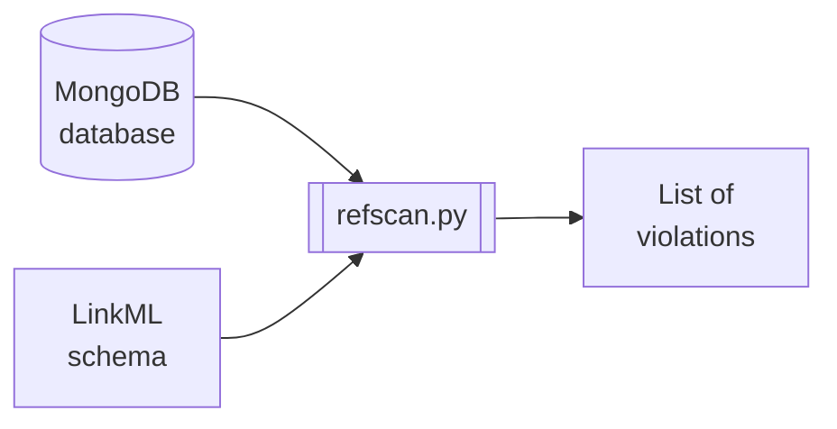

# refscan

`refscan` is a command-line tool people can use to scan the NMDC MongoDB database
for referential integrity violations.

## Development status

`refscan` is in early development and its author does not recommend anyone use it for anything.
