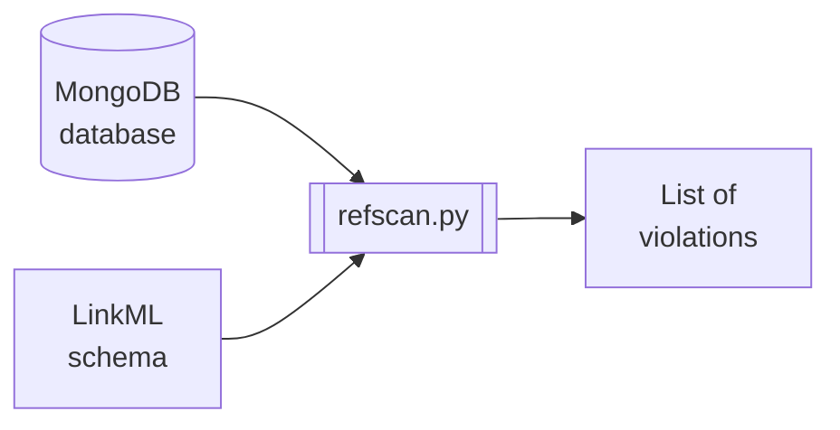

# refscan

`refscan` is a command-line tool people can use to scan the NMDC MongoDB database
for referential integrity violations.

## Assumptions

`refscan` was designed under some assumptions about the user's schema and database, including:

1. Each source document (i.e. document containing references) has a field named `type`, whose value (a string) is the [class_uri](https://linkml.io/linkml/code/metamodel.html#linkml_runtime.linkml_model.meta.ClassDefinition.class_uri) of the schema class of which the document represents an instance. For example, the `type` field of each document in the `study_set` collection has the value `"nmdc:Study"`. 

## Development status

`refscan` is in early development and its author does not recommend anyone use it for anything.
