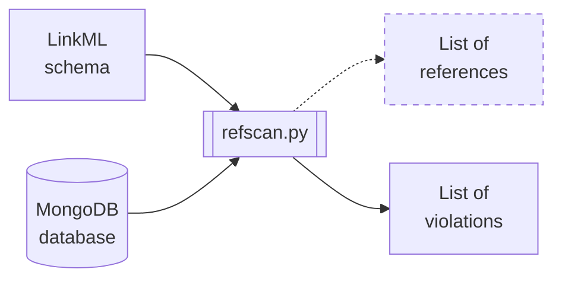

# refscan

`refscan` is a command-line tool people can use to scan the NMDC MongoDB database
for referential integrity violations.



## Assumptions

`refscan` was designed under some assumptions about the schema and database, including:

1. Each source document (i.e. document containing references) has a field named `type`, whose value (a string) is the [class_uri](https://linkml.io/linkml/code/metamodel.html#linkml_runtime.linkml_model.meta.ClassDefinition.class_uri) of the schema class of which the document represents an instance. For example, the `type` field of each document in the `study_set` collection has the value `"nmdc:Study"`. 

## Development status

`refscan` is in early development and its author does not recommend anyone use it for anything without reviewing its code first.

## Tips

`refscan` requires the user to specify the path to a schema in YAML format. If you have `curl` installed, you can download a YAML file from GitHub by running the following command (after replacing the `{...}` placeholders and customizing the path):

```shell
# Download the raw content of https://github.com/{user_or_org}/{repo}/blob/{branch}/path/to/schema.yaml
curl -o schema.yaml https://raw.githubusercontent.com/{user_or_org}/{repo}/{branch}/path/to/schema.yaml
```

For example:

```shell
# Download the raw content of https://github.com/microbiomedata/berkeley-schema-fy24/blob/main/nmdc_schema/nmdc_materialized_patterns.yaml
curl -o schema.yaml https://raw.githubusercontent.com/microbiomedata/berkeley-schema-fy24/main/nmdc_schema/nmdc_materialized_patterns.yaml
```
